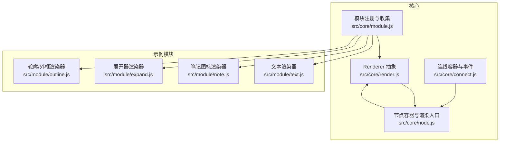
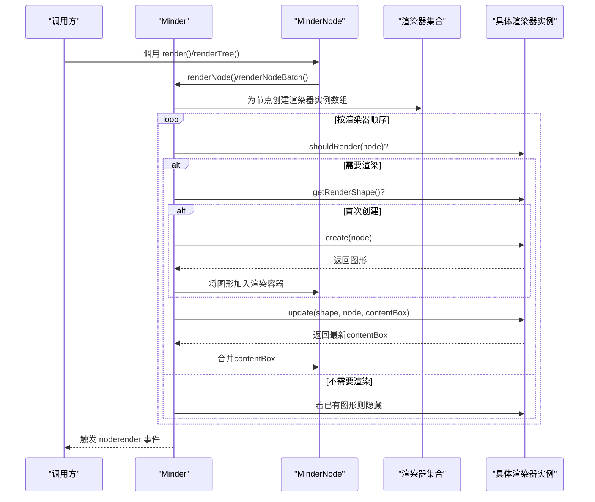
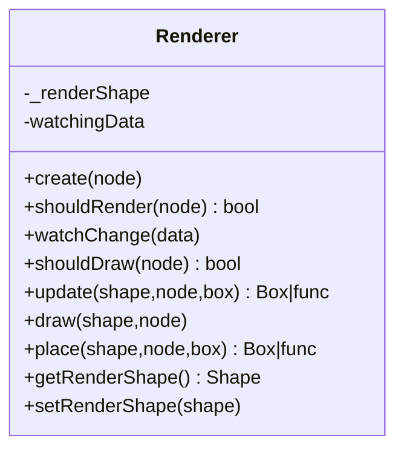
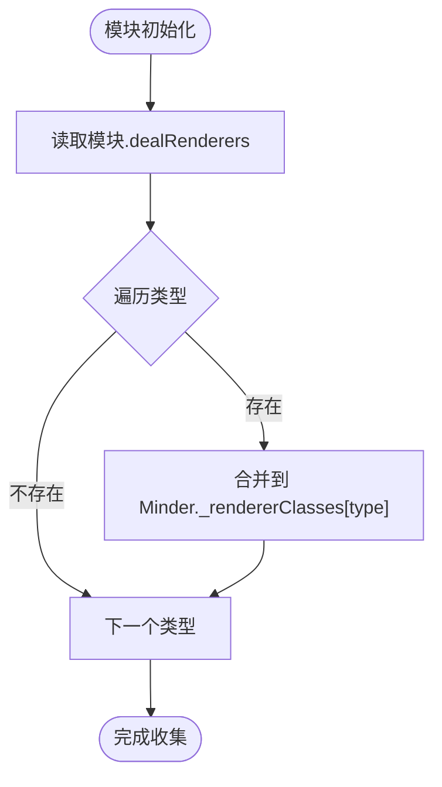
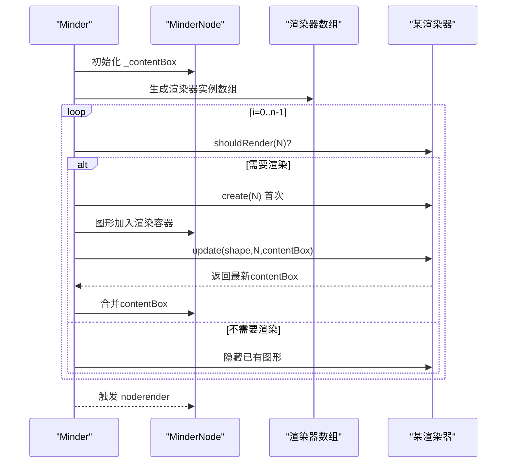
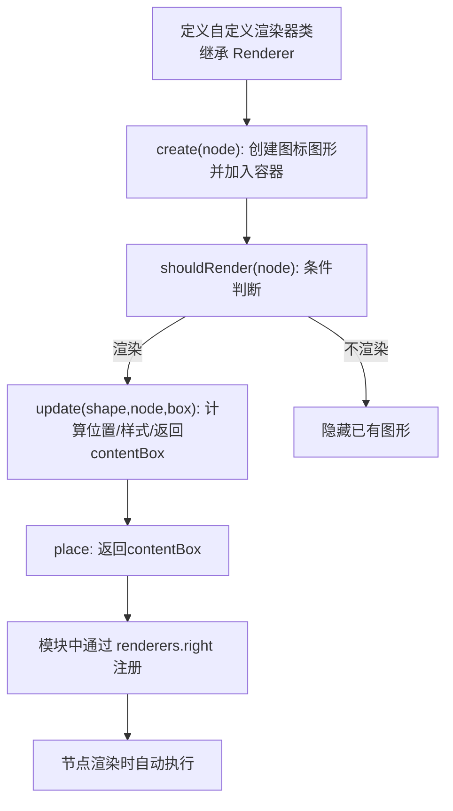
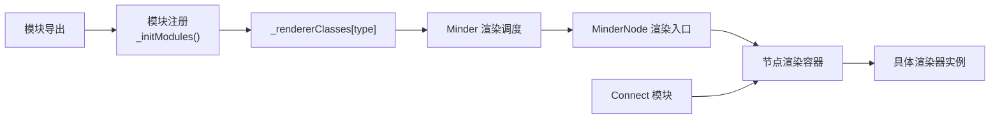

# 渲染器扩展

<cite>
**本文引用的文件列表**
- [src/core/render.js](file://src/core/render.js)
- [src/core/module.js](file://src/core/module.js)
- [src/core/node.js](file://src/core/node.js)
- [src/module/text.js](file://src/module/text.js)
- [src/module/note.js](file://src/module/note.js)
- [src/module/expand.js](file://src/module/expand.js)
- [src/module/outline.js](file://src/module/outline.js)
- [src/core/connect.js](file://src/core/connect.js)
</cite>

## 目录
1. [引言](#引言)
2. [项目结构](#项目结构)
3. [核心组件](#核心组件)
4. [架构总览](#架构总览)
5. [详细组件分析](#详细组件分析)
6. [依赖关系分析](#依赖关系分析)
7. [性能考量](#性能考量)
8. [故障排查指南](#故障排查指南)
9. [结论](#结论)
10. [附录](#附录)

## 引言
本篇文档面向中高级开发者，系统讲解如何在模块定义中通过 renderers 字段注册自定义渲染器，以扩展节点或连线的视觉表现。我们将深入解析渲染器类的生命周期方法（create、shouldRender、update、draw、place、watchChange、shouldDraw），以及它们与核心渲染系统的集成方式；解释不同渲染类型（如 node 的 center/left/right/top/bottom/outline/outside 等）的注册机制与执行顺序；并提供实现一个自定义节点图标渲染器的完整示例，展示如何将扩展的视觉元素注入到节点渲染容器中。最后讨论渲染性能优化策略、与其他模块渲染器的兼容性处理以及动态样式更新的最佳实践。

## 项目结构
围绕渲染扩展的关键文件分布如下：
- 核心渲染抽象与调度：src/core/render.js
- 模块注册与渲染器收集：src/core/module.js
- 节点容器与渲染入口：src/core/node.js
- 示例渲染器：src/module/text.js、src/module/note.js、src/module/expand.js、src/module/outline.js
- 连线渲染与容器：src/core/connect.js

图表来源
- [src/core/render.js](file://src/core/render.js#L1-L261)
- [src/core/module.js](file://src/core/module.js#L1-L151)
- [src/core/node.js](file://src/core/node.js#L1-L407)
- [src/core/connect.js](file://src/core/connect.js#L89-L126)
- [src/module/text.js](file://src/module/text.js#L1-L289)
- [src/module/note.js](file://src/module/note.js#L72-L116)
- [src/module/expand.js](file://src/module/expand.js#L175-L203)
- [src/module/outline.js](file://src/module/outline.js#L10-L65)

章节来源
- [src/core/render.js](file://src/core/render.js#L1-L261)
- [src/core/module.js](file://src/core/module.js#L1-L151)
- [src/core/node.js](file://src/core/node.js#L1-L407)
- [src/core/connect.js](file://src/core/connect.js#L89-L126)
- [src/module/text.js](file://src/module/text.js#L1-L289)
- [src/module/note.js](file://src/module/note.js#L72-L116)
- [src/module/expand.js](file://src/module/expand.js#L175-L203)
- [src/module/outline.js](file://src/module/outline.js#L10-L65)

## 核心组件
- 渲染器基类 Renderer：定义统一的生命周期方法与状态管理，包括 create、shouldRender、watchChange、shouldDraw、update、draw、place、getRenderShape、setRenderShape。
- 模块注册与收集：模块通过 renderers 字段向 Minder 注册渲染器类型映射，按类型分组并支持 before/after 分段插入。
- 节点渲染入口：MinderNode 提供 render/renderTree，委托给 Minder 的渲染流程；Minder 负责批量/单个节点渲染与事件分发。
- 连线渲染：Connect 模块负责连线容器与事件驱动的更新，与节点渲染器协同工作。

章节来源
- [src/core/render.js](file://src/core/render.js#L1-L58)
- [src/core/module.js](file://src/core/module.js#L97-L111)
- [src/core/node.js](file://src/core/node.js#L225-L258)
- [src/core/connect.js](file://src/core/connect.js#L107-L123)

## 架构总览
渲染系统采用“模块注册 + 类型分组 + 生命周期调度”的架构：
- 模块在初始化时将 renderers 映射写入 Minder._rendererClasses[type]。
- 渲染阶段按节点构建渲染器实例数组，按“before + 中间 + after”顺序依次执行。
- 每个渲染器独立管理自己的图形形状（getRenderShape/setRenderShape），并在 update 中决定绘制与定位。
- 节点内容盒（contentBox）在各渲染器之间传递与合并，用于后续定位与布局参考。

图表来源
- [src/core/render.js](file://src/core/render.js#L85-L219)
- [src/core/node.js](file://src/core/node.js#L225-L258)

## 详细组件分析

### 渲染器基类与生命周期
- 基类职责：提供统一的 create、draw、place、update、shouldRender、shouldDraw、watchChange 等方法约定，并维护渲染图形引用。
- 生命周期要点：
  - create：首次创建渲染图形，返回图形对象。
  - shouldRender：判断当前上下文是否需要渲染该渲染器。
  - update：根据 shouldDraw 决定是否 draw，随后 place 定位，返回 contentBox。
  - draw/place：具体绘制与定位逻辑，由子类实现。
  - watchChange/watchingData：用于基于数据变化的增量更新判断。
  - bringToBack：控制图形插入顺序（back/forward）。

图表来源
- [src/core/render.js](file://src/core/render.js#L1-L58)

章节来源
- [src/core/render.js](file://src/core/render.js#L1-L58)

### 模块注册与渲染器收集
- 模块通过 renderers 字段导出类型到渲染器类的映射，支持数组（多渲染器）与单类。
- Minder 在初始化时将 renderers 合并到 _rendererClasses[type]，并按“before + 中间 + after”分段收集，形成最终渲染器序列。

图表来源
- [src/core/module.js](file://src/core/module.js#L97-L111)

章节来源
- [src/core/module.js](file://src/core/module.js#L97-L111)

### 节点渲染入口与内容盒传递
- MinderNode.render/renderTree 将渲染委托给 Minder。
- Minder.renderNode/renderNodeBatch：
  - 为节点创建渲染器实例数组（按 before/中间/after 顺序）。
  - 逐个渲染器执行 shouldRender、create、update、place。
  - 将每个渲染器返回的 contentBox 合并到节点的 _contentBox，供后续渲染器使用。
  - 渲染完成后触发 noderender 事件。

图表来源
- [src/core/render.js](file://src/core/render.js#L85-L219)
- [src/core/node.js](file://src/core/node.js#L225-L258)

章节来源
- [src/core/render.js](file://src/core/render.js#L85-L219)
- [src/core/node.js](file://src/core/node.js#L225-L258)

### 渲染类型与执行顺序
- 类型分组：center、left、right、top、bottom、outline、outside。
- 顺序规则：每个分组内部按“beforeX + X + afterX”顺序拼接，形成最终渲染器序列。
- 实际应用示例：
  - 文本渲染器注册在 center。
  - 笔记图标渲染器注册在 right。
  - 展开器渲染器注册在 outside。
  - 轮廓/外框渲染器注册在 outline/outside。

章节来源
- [src/core/render.js](file://src/core/render.js#L62-L83)
- [src/module/text.js](file://src/module/text.js#L278-L286)
- [src/module/note.js](file://src/module/note.js#L107-L111)
- [src/module/expand.js](file://src/module/expand.js#L252-L256)
- [src/module/outline.js](file://src/module/outline.js#L158-L162)

### 连线渲染与容器
- Connect 模块在 Minder 初始化时创建连线容器并前置到渲染容器中。
- 通过事件驱动（nodeattach/nodedetach/layoutapply/layoutfinish/noderender）更新连线。
- 连线图形的样式（颜色、宽度）从节点样式读取，提供连接提供者（provider）计算路径。

章节来源
- [src/core/connect.js](file://src/core/connect.js#L107-L123)
- [src/core/connect.js](file://src/core/connect.js#L89-L105)

### 自定义节点图标渲染器示例（实现思路）
目标：为节点右侧添加一个可交互的图标渲染器，随节点内容变化而更新位置与样式。
- 步骤概览：
  - 定义渲染器类，继承 Renderer。
  - 在 create 中创建图标图形并挂载到节点渲染容器。
  - 在 shouldRender 中根据节点数据（如是否存在 note）决定是否渲染。
  - 在 update 中根据 contentBox 计算图标位置，设置样式并返回图标边界盒。
  - 在模块中通过 renderers.right 注册该渲染器。
  - 在节点渲染后，可通过 MinderNode.getRenderer('YourRenderer') 获取图形进行进一步操作。

图表来源
- [src/core/render.js](file://src/core/render.js#L1-L58)
- [src/module/note.js](file://src/module/note.js#L72-L104)

章节来源
- [src/core/render.js](file://src/core/render.js#L1-L58)
- [src/module/note.js](file://src/module/note.js#L72-L104)

### 典型渲染器实现对比
- 文本渲染器（center）：创建文本组，按行渲染，兼容多浏览器文字对齐，返回文本边界盒。
- 笔记图标渲染器（right）：仅当节点存在 note 数据时渲染，图标位于 contentBox 右侧，支持 hover/edit 事件。
- 展开器渲染器（outside）：根节点不渲染，根据父节点展开状态与自身状态设置图标形态，定位在节点边界的特定向量上。
- 轮廓渲染器（outline）：根据节点样式绘制背景/描边，支持圆角与圆形特殊处理，必要时置底绘制。

章节来源
- [src/module/text.js](file://src/module/text.js#L129-L236)
- [src/module/note.js](file://src/module/note.js#L72-L104)
- [src/module/expand.js](file://src/module/expand.js#L175-L203)
- [src/module/outline.js](file://src/module/outline.js#L10-L65)

## 依赖关系分析
- 模块注册依赖 Minder 的初始化钩子，将模块导出的 renderers 合并到全局映射。
- 渲染器依赖 Kity 图形库，通过节点渲染容器 Group 管理图形层次。
- 节点渲染依赖 Minder 的事件流（beforerender/noderender）与内容盒合并逻辑。
- 连线渲染依赖节点布局信息与样式，通过事件驱动更新。

图表来源
- [src/core/module.js](file://src/core/module.js#L18-L118)
- [src/core/render.js](file://src/core/render.js#L85-L219)
- [src/core/node.js](file://src/core/node.js#L225-L258)
- [src/core/connect.js](file://src/core/connect.js#L107-L123)

章节来源
- [src/core/module.js](file://src/core/module.js#L18-L118)
- [src/core/render.js](file://src/core/render.js#L85-L219)
- [src/core/node.js](file://src/core/node.js#L225-L258)
- [src/core/connect.js](file://src/core/connect.js#L107-L123)

## 性能考量
- 图形复用与懒创建：仅在 shouldRender 为真且尚未创建时调用 create，避免重复创建。
- 可见性控制：不需要渲染时隐藏已有图形，减少不必要的绘制。
- 内容盒缓存：渲染器可缓存上次计算结果（如文本哈希），在数据未变化时直接返回缓存盒，降低重排成本。
- 批量渲染：优先使用 renderNodeBatch，利用一次性遍历与延迟盒计算，减少多次 DOM 操作。
- 插入顺序：bringToBack 控制图形层级，避免频繁重排；必要时将轮廓等底层图形置底。
- 事件驱动：连线与布局通过事件触发更新，避免轮询带来的性能损耗。

章节来源
- [src/core/render.js](file://src/core/render.js#L130-L156)
- [src/core/render.js](file://src/core/render.js#L180-L214)
- [src/module/text.js](file://src/module/text.js#L213-L236)
- [src/module/outline.js](file://src/module/outline.js#L13-L21)

## 故障排查指南
- 渲染器未生效
  - 检查模块是否正确注册 renderers 字段，类型是否匹配（center/left/right/top/bottom/outline/outside）。
  - 确认 shouldRender 返回值符合预期（如笔记图标需节点存在 note 数据）。
- 图形未显示
  - 确认 create 返回了有效图形对象，并已加入节点渲染容器。
  - 检查 setVisible(true) 是否被调用（框架会在需要时强制显示）。
- 位置错乱
  - 检查 update 返回的 contentBox 是否正确，确保与节点内容盒一致。
  - 注意节点折叠状态下 getContentBox 返回空盒，可能影响定位。
- 事件冲突
  - 自定义图标若绑定交互事件，注意阻止事件冒泡，避免影响其他模块状态。
- 连线异常
  - 检查节点样式（颜色/宽度）与连接提供者（provider）是否正确配置。
  - 确保事件触发链路（layoutapply/layoutfinish/noderender）正常。

章节来源
- [src/core/render.js](file://src/core/render.js#L130-L156)
- [src/core/render.js](file://src/core/render.js#L180-L214)
- [src/module/note.js](file://src/module/note.js#L72-L104)
- [src/core/node.js](file://src/core/node.js#L248-L258)
- [src/core/connect.js](file://src/core/connect.js#L89-L105)

## 结论
通过模块化的 renderers 字段，开发者可以灵活地为节点与连线扩展丰富的视觉表现。核心渲染系统提供了清晰的生命周期与调度机制，配合类型分组与事件驱动，既保证了扩展性，也兼顾了性能与一致性。遵循本文的实现思路与最佳实践，可在不破坏现有渲染管线的前提下，安全地引入自定义渲染器并与其他模块协同工作。

## 附录
- 常用渲染类型对照
  - center：节点中心内容（如文本）
  - left/right/top/bottom：节点四侧扩展
  - outline：节点轮廓/背景
  - outside：节点外部装饰（如展开器、阴影）
- 推荐实现清单
  - 明确 shouldRender 条件，避免无谓渲染。
  - 使用 contentBox 缓存与延迟盒，提升批量渲染效率。
  - 合理使用 bringToBack，控制层级顺序。
  - 为交互图形绑定事件时，注意事件冒泡与默认行为的处理。
  - 对于连线，确保样式与 provider 的一致性。