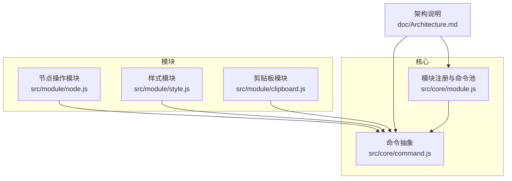
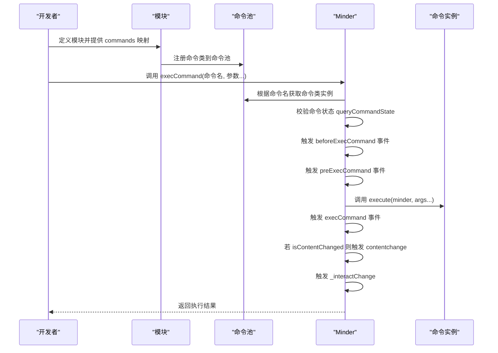
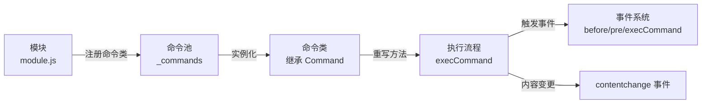

# 自定义命令注册

<cite>
**本文引用的文件**
- [Architecture.md](file://doc/Architecture.md)
- [command.js](file://src/core/command.js)
- [module.js](file://src/core/module.js)
- [node.js](file://src/module/node.js)
- [style.js](file://src/module/style.js)
- [clipboard.js](file://src/module/clipboard.js)
</cite>

## 目录
1. [引言](#引言)
2. [项目结构](#项目结构)
3. [核心组件](#核心组件)
4. [架构总览](#架构总览)
5. [详细组件分析](#详细组件分析)
6. [依赖分析](#依赖分析)
7. [性能考虑](#性能考虑)
8. [故障排查指南](#故障排查指南)
9. [结论](#结论)
10. [附录](#附录)

## 引言
本篇文档面向中高级开发者，系统讲解如何在模块定义中通过 commands 字段注册自定义命令。内容涵盖：
- 命令类的创建与继承 Command 基类
- 关键方法重写：execute 执行、revert 撤销、queryState 状态查询
- 命令注册后如何进入命令池并支持 execCommand 调用
- 结合 Architecture.md 中的 Command 抽象类定义，阐明命令与模块的依附关系
- 命令执行时对内容变更与选区变更的标记机制
- 提供一个可撤销的节点样式修改命令的完整实现示例，说明命令参数传递与状态查询的应用场景

## 项目结构
围绕命令系统的关键文件与职责如下：
- 命令抽象与执行：src/core/command.js
- 模块注册与命令池：src/core/module.js
- 模块示例：src/module/node.js、src/module/style.js、src/module/clipboard.js
- 架构说明：doc/Architecture.md

图表来源
- [command.js](file://src/core/command.js#L1-L169)
- [module.js](file://src/core/module.js#L1-L151)
- [node.js](file://src/module/node.js#L1-L150)
- [style.js](file://src/module/style.js#L1-L114)
- [clipboard.js](file://src/module/clipboard.js#L1-L172)
- [Architecture.md](file://doc/Architecture.md#L140-L196)

章节来源
- [command.js](file://src/core/command.js#L1-L169)
- [module.js](file://src/core/module.js#L1-L151)
- [node.js](file://src/module/node.js#L1-L150)
- [style.js](file://src/module/style.js#L1-L114)
- [clipboard.js](file://src/module/clipboard.js#L1-L172)
- [Architecture.md](file://doc/Architecture.md#L140-L196)

## 核心组件
- 命令抽象类 Command
  - 定义命令的执行入口 execute、撤销入口 revert、状态查询 queryState、值查询 queryValue
  - 提供 isContentChanged/isSelectionChanged 标记命令对内容与选区的影响
  - 提供 isNeedUndo 用于撤销能力声明
- MindMinder 命令执行链
  - execCommand 将命令名标准化，校验状态，触发 before/pre/execCommand 事件
  - 根据命令的 isContentChanged 标记触发 contentchange 事件
  - 触发 _interactChange 以统一处理交互后事件
- 模块注册与命令池
  - 模块初始化时，将模块的 commands 映射注册到 Minder 的 _commands 命令池
  - 命令池以命令名为键，值为命令实例（new 命令类）

章节来源
- [command.js](file://src/core/command.js#L1-L169)
- [module.js](file://src/core/module.js#L1-L151)
- [Architecture.md](file://doc/Architecture.md#L140-L196)

## 架构总览
命令系统围绕“模块-命令-执行器”的三层结构工作：
- 模块层：在模块定义中通过 commands 字典注册命令类
- 命令层：命令类继承 Command，实现执行、撤销、状态查询等方法
- 执行层：Minder 在 execCommand 中解析命令名、参数，触发事件并根据标记决定是否触发内容/选区变更事件

图表来源
- [module.js](file://src/core/module.js#L83-L87)
- [command.js](file://src/core/command.js#L118-L166)
- [Architecture.md](file://doc/Architecture.md#L140-L196)

## 详细组件分析

### 命令基类与方法重写
- 继承与创建
  - 使用框架提供的类创建方法，以 base: Command 方式继承
  - 必须重写 execute 方法；revert 可选（未提供则不可撤销）
  - 可重写 queryState/queryValue 以控制命令可用性与返回值
- 影响标记
  - setContentChanged/setSelectionChanged 用于标记命令对内容/选区的影响
  - Minder 在执行后根据 isContentChanged 触发 contentchange 事件
- 状态语义
  - queryState 返回 -1/0/1 分别表示不可执行/可执行/已执行（用于 UI 状态联动）

章节来源
- [Architecture.md](file://doc/Architecture.md#L140-L196)
- [command.js](file://src/core/command.js#L1-L57)

### 模块注册与命令池
- 模块定义
  - 模块通过返回对象提供 commands 字典，键为命令名（小写），值为命令类
  - 模块还可提供 events、defaultOptions、init、reset、destroy 等生命周期钩子
- 命令池构建
  - 初始化时，模块系统遍历模块的 commands，将每个命令类实例化并放入 Minder 的 _commands 命令池
  - 命令名在注册时统一转为小写，调用 execCommand 时也会转换为小写匹配

章节来源
- [Architecture.md](file://doc/Architecture.md#L198-L255)
- [module.js](file://src/core/module.js#L83-L87)

### 命令执行流程与事件
- execCommand 流程
  - 校验命令名与状态（queryCommandState）
  - 触发 beforeExecCommand、preExecCommand 事件
  - 调用命令 execute 并返回结果
  - 触发 execCommand 事件
  - 若命令标记内容变更，触发 contentchange
  - 触发 _interactChange
- 事件与状态联动
  - beforeExecCommand/preExecCommand/execCommand 为命令执行前后提供钩子
  - contentchange 事件用于通知内容变更，驱动 UI 更新
  - selectionchange/interactchange 由 Minder 的事件机制统一触发

章节来源
- [command.js](file://src/core/command.js#L118-L166)
- [Architecture.md](file://doc/Architecture.md#L374-L430)

### 示例：节点样式修改命令（可撤销）
以下为一个可撤销的节点样式修改命令的完整实现步骤与要点说明（不直接展示代码，仅给出路径与要点）：
- 命令类定义
  - 继承 Command，重写 execute 与 revert
  - 在 execute 中记录旧样式并应用新样式，必要时调用渲染与布局
  - 在 revert 中恢复旧样式
  - 使用 setContentChanged 标记内容变更
- 状态查询
  - queryState 根据当前选中节点数量与是否存在可修改样式返回 -1/0
- 参数传递
  - 通过 execCommand 的参数列表传入样式键值对
- 注册到模块
  - 在模块的 commands 字典中注册命令类
  - 可选地提供快捷键映射

参考实现路径
- 命令基类与影响标记：[command.js](file://src/core/command.js#L1-L57)
- 命令执行与事件：[command.js](file://src/core/command.js#L118-L166)
- 模块注册与命令池：[module.js](file://src/core/module.js#L83-L87)
- 可参考的样式命令实现：[style.js](file://src/module/style.js#L1-L114)
- 可参考的节点命令实现：[node.js](file://src/module/node.js#L1-L150)
- 可参考的剪贴板命令（含 setContentChanged 使用）：[clipboard.js](file://src/module/clipboard.js#L1-L172)

章节来源
- [command.js](file://src/core/command.js#L1-L57)
- [command.js](file://src/core/command.js#L118-L166)
- [module.js](file://src/core/module.js#L83-L87)
- [style.js](file://src/module/style.js#L1-L114)
- [node.js](file://src/module/node.js#L1-L150)
- [clipboard.js](file://src/module/clipboard.js#L1-L172)

### 命令参数传递与状态查询的应用场景
- 参数传递
  - execCommand 支持将任意参数传入命令 execute，适合传递样式键值、节点集合、布尔开关等
- 状态查询
  - queryState 用于 UI 控件启用/禁用判断
  - queryValue 用于返回命令相关值（如进度、统计信息），供 UI 展示
- 事件联动
  - before/pre/execCommand 事件可用于日志、埋点、撤销栈管理等

章节来源
- [command.js](file://src/core/command.js#L87-L106)
- [command.js](file://src/core/command.js#L118-L166)
- [Architecture.md](file://doc/Architecture.md#L374-L430)

## 依赖分析
- 模块到命令的依赖
  - 各模块通过 commands 字典将命令类注入命令池
  - 命令类依赖 Command 基类提供的执行与标记能力
- 执行器到命令的依赖
  - Minder 在执行时依赖命令类的 execute/revert/queryState
  - Minder 通过事件系统与命令协作，实现内容变更与交互事件的统一处理

图表来源
- [module.js](file://src/core/module.js#L83-L87)
- [command.js](file://src/core/command.js#L118-L166)
- [Architecture.md](file://doc/Architecture.md#L374-L430)

章节来源
- [module.js](file://src/core/module.js#L1-L151)
- [command.js](file://src/core/command.js#L1-L169)
- [Architecture.md](file://doc/Architecture.md#L374-L430)

## 性能考虑
- 命令执行成本
  - 执行过程中尽量减少不必要的渲染与布局调用，必要时批量更新
- 事件触发频率
  - contentchange 与 _interactChange 会触发 UI 更新，应避免在高频命令中频繁触发
- 选区与内容标记
  - 合理使用 setContentChanged/setSelectionChanged，避免误报导致不必要的刷新

## 故障排查指南
- 命令未生效
  - 检查模块是否正确注册命令类到 commands 字典
  - 检查命令名大小写是否与注册一致（注册与调用均转为小写）
- 命令不可执行
  - 检查 queryState 是否返回 -1 或 0
  - 检查命令参数是否满足执行条件
- 撤销无效
  - 确认命令类是否实现 revert
  - 确认 isNeedUndo 是否为 true（若需撤销）
- 事件未触发
  - 检查 before/pre/execCommand/contentchange 事件是否被正确绑定
  - 检查命令是否标记了内容变更

章节来源
- [module.js](file://src/core/module.js#L83-L87)
- [command.js](file://src/core/command.js#L118-L166)
- [clipboard.js](file://src/module/clipboard.js#L1-L172)

## 结论
通过模块的 commands 字段，开发者可以将自定义命令无缝接入命令系统。命令类需遵循 Command 基类约定，合理重写执行、撤销与状态查询方法，并通过 setContentChanged/setSelectionChanged 标记变更，确保 Minder 能正确触发事件与 UI 更新。结合 Architecture.md 的抽象定义与现有模块示例，可快速实现可撤销、可查询、可扩展的命令体系。

## 附录
- 命令类创建与继承
  - 参考路径：[style.js](file://src/module/style.js#L1-L114)
- 命令注册到模块
  - 参考路径：[node.js](file://src/module/node.js#L133-L149)
- 命令池构建
  - 参考路径：[module.js](file://src/core/module.js#L83-L87)
- 命令执行与事件
  - 参考路径：[command.js](file://src/core/command.js#L118-L166)
- 影响标记示例
  - 参考路径：[clipboard.js](file://src/module/clipboard.js#L54-L61)