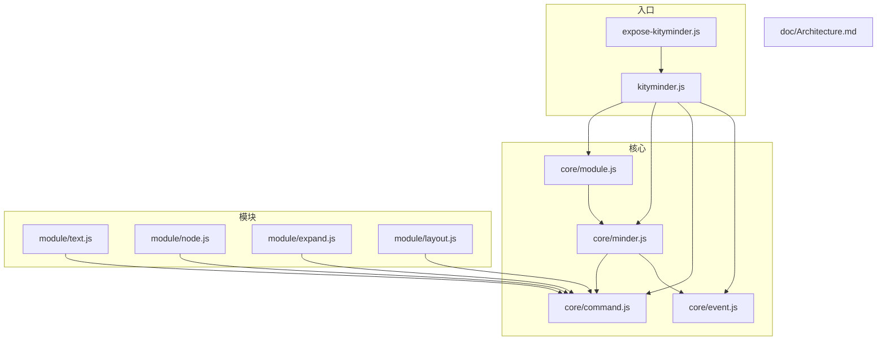
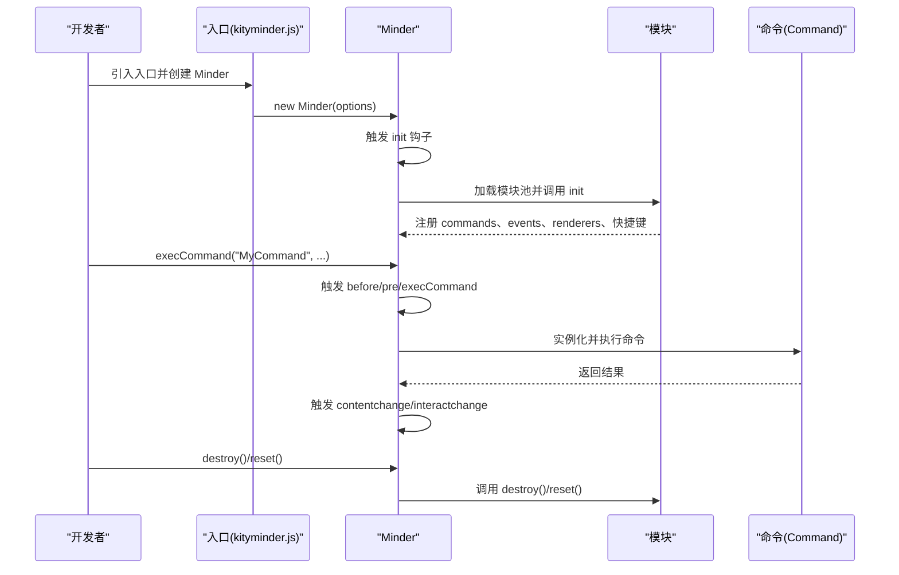
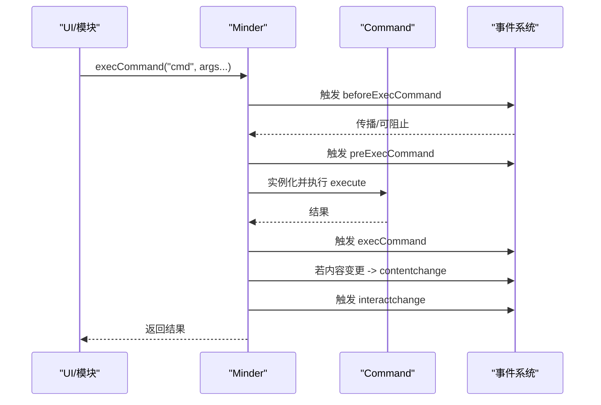
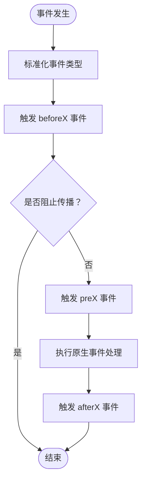
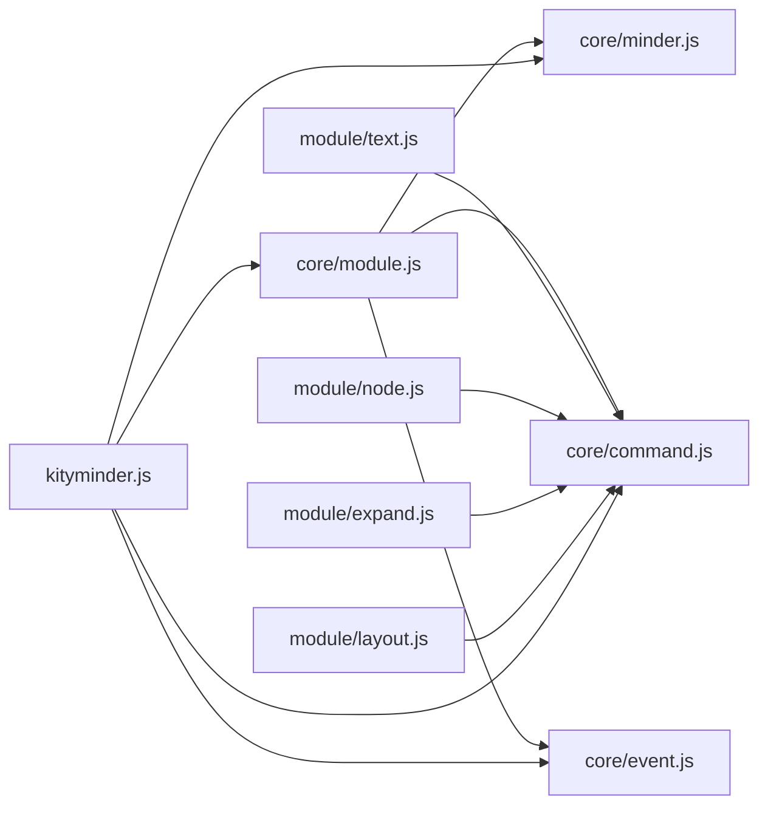

# 自定义模块开发

<cite>
**本文引用的文件**
- [Architecture.md](file://doc/Architecture.md)
- [module.js](file://src/core/module.js)
- [minder.js](file://src/core/minder.js)
- [command.js](file://src/core/command.js)
- [event.js](file://src/core/event.js)
- [text.js](file://src/module/text.js)
- [node.js](file://src/module/node.js)
- [expand.js](file://src/module/expand.js)
- [layout.js](file://src/module/layout.js)
- [kityminder.js](file://src/kityminder.js)
- [expose-kityminder.js](file://src/expose-kityminder.js)
</cite>

## 目录
1. [简介](#简介)
2. [项目结构](#项目结构)
3. [核心组件](#核心组件)
4. [架构总览](#架构总览)
5. [详细组件分析](#详细组件分析)
6. [依赖分析](#依赖分析)
7. [性能考虑](#性能考虑)
8. [故障排查指南](#故障排查指南)
9. [结论](#结论)
10. [附录](#附录)

## 简介
本指南面向有经验的开发者，系统讲解如何使用 KityMinder 的模块机制创建自定义功能模块。重点覆盖：
- 模块定义结构与生命周期：init、destroy、reset
- defaultOptions 的定义与使用
- 通过 commands 字段注册自定义命令
- 事件系统在模块中的应用：交互事件与 command 事件
- 从零开始创建一个功能模块的完整流程
- 模块间依赖管理、资源回收与性能优化

## 项目结构
KityMinder 采用模块化架构，核心运行时位于 core 目录，功能模块位于 module 目录，入口文件统一导出。

图表来源
- [kityminder.js](file://src/kityminder.js#L1-L107)
- [module.js](file://src/core/module.js#L1-L151)
- [minder.js](file://src/core/minder.js#L1-L41)
- [command.js](file://src/core/command.js#L1-L169)
- [event.js](file://src/core/event.js#L1-L270)
- [text.js](file://src/module/text.js#L1-L289)
- [node.js](file://src/module/node.js#L1-L150)
- [expand.js](file://src/module/expand.js#L1-L294)
- [layout.js](file://src/module/layout.js#L1-L92)
- [expose-kityminder.js](file://src/expose-kityminder.js#L1-L3)

章节来源
- [kityminder.js](file://src/kityminder.js#L1-L107)
- [Architecture.md](file://doc/Architecture.md#L1-L120)

## 核心组件
- 模块注册与生命周期管理：由 core/module.js 提供模块注册、初始化、命令注册、事件绑定、渲染器注册、快捷键注册，以及 destroy/reset 生命周期钩子。
- Minder 核心：负责实例化、事件分发、命令执行、状态管理等。
- 命令系统：Command 基类定义命令的执行、回退、状态查询、值查询等。
- 事件系统：MinderEvent 包装原生事件，提供统一的事件分发、传播控制、坐标转换等能力。

章节来源
- [module.js](file://src/core/module.js#L1-L151)
- [minder.js](file://src/core/minder.js#L1-L41)
- [command.js](file://src/core/command.js#L1-L169)
- [event.js](file://src/core/event.js#L1-L270)

## 架构总览
模块开发遵循以下规范与流程：
- 模块定义结构：defaultOptions、init、commands、events、destroy、reset、renderers、contextmenu、commandShortcutKeys 等字段。
- 模块注册：通过 Module.register 或在入口中 require 对应模块文件。
- 初始化流程：Minder 在构造阶段执行注册的 init 钩子，加载模块池中的模块，注册命令、事件、渲染器、快捷键。
- 命令执行：Minder.execCommand 触发 before/pre/execCommand 事件，执行命令并根据变更触发 contentchange/interactchange。
- 生命周期：destroy 在 Minder.destroy 时逐模块调用；reset 在 Minder.reset 时逐模块调用。

图表来源
- [kityminder.js](file://src/kityminder.js#L1-L107)
- [module.js](file://src/core/module.js#L1-L151)
- [command.js](file://src/core/command.js#L118-L166)
- [event.js](file://src/core/event.js#L162-L192)

## 详细组件分析

### 模块定义与生命周期
- defaultOptions：模块可提供默认配置项，Minder 在初始化时合并到全局配置。
- init(options)：模块初始化入口，this 指向 Minder 实例，options 为最终配置。
- commands：以键值对形式注册命令类，键名为命令名（小写），值为命令类。
- events：模块监听的事件，键为事件名（支持空格分隔多事件），值为回调函数。
- destroy()：模块资源回收入口，this 指向 Minder 实例。
- reset()：模块重置入口，this 指向 Minder 实例。
- renderers：渲染器注册，按类型聚合。
- contextmenu：上下文菜单项定义（模块特定）。
- commandShortcutKeys：命令快捷键映射（模块特定）。

章节来源
- [Architecture.md](file://doc/Architecture.md#L198-L255)
- [module.js](file://src/core/module.js#L40-L117)

### 命令系统与命令执行
- Command 基类：定义 execute、revert、queryState、queryValue、isContentChanged/isSelectionChanged 等。
- Minder.execCommand：规范化命令名（小写），触发 before/pre/execCommand 事件，执行命令，根据内容变更触发 contentchange，最后触发 interactchange。
- Minder.queryCommandState/value：查询命令状态与值。

图表来源
- [command.js](file://src/core/command.js#L118-L166)
- [event.js](file://src/core/event.js#L162-L192)

章节来源
- [command.js](file://src/core/command.js#L1-L169)
- [event.js](file://src/core/event.js#L1-L270)

### 事件系统在模块中的应用
- 交互事件：click、keydown、keyup、mousemove、touch 等，MinderEvent 提供 getPosition/getTargetNode 等辅助。
- Command 事件：beforecommand、precommand、aftercommand（通过 before/pre/after 前缀派发）。
- 模块事件：模块可自定义事件并通过 Minder.fire 触发。
- 事件绑定：模块在 events 字段中注册回调，Minder.on 统一绑定。

图表来源
- [event.js](file://src/core/event.js#L162-L192)

章节来源
- [event.js](file://src/core/event.js#L1-L270)
- [module.js](file://src/core/module.js#L90-L95)

### 从零开始创建一个功能模块（全流程）
以下为从零开始创建一个功能模块的步骤与要点，结合仓库中的实际模块示例进行说明。

- 步骤一：定义模块结构
  - 在模块文件中调用 Module.register 或返回模块对象（函数式模块）。
  - 提供 defaultOptions（可选）、init（可选）、commands、events（可选）、destroy（可选）、reset（可选）、renderers（可选）、contextmenu（可选）、commandShortcutKeys（可选）。
  - 参考：[Architecture.md 模块定义规范](file://doc/Architecture.md#L198-L255)

- 步骤二：注册命令
  - 在 commands 中注册命令类，键名为命令名（小写）。
  - 命令类继承 Command，至少实现 execute；可实现 revert/queryState/queryValue/isContentChanged/isSelectionChanged。
  - 参考：[text.js 命令示例](file://src/module/text.js#L245-L262)、[node.js 命令示例](file://src/module/node.js#L11-L100)、[layout.js 命令示例](file://src/module/layout.js#L15-L74)

- 步骤三：绑定事件
  - 在 events 中注册交互事件（如 click、keydown）与模块自定义事件。
  - 在回调中使用 this 指向 Minder 实例，通过 minder.getSelectedNode/Nodes 等 API 操作节点。
  - 参考：[expand.js 事件示例](file://src/module/expand.js#L212-L251)

- 步骤四：渲染器与上下文菜单（可选）
  - renderers：注册渲染器类，按类型（如 center/outside）挂载。
  - contextmenu：定义上下文菜单项，支持命令、分隔符等。
  - 参考：[text.js 渲染器与命令注册](file://src/module/text.js#L272-L288)、[expand.js 渲染器与上下文菜单](file://src/module/expand.js#L176-L291)

- 步骤五：快捷键（可选）
  - commandShortcutKeys：为命令绑定快捷键，格式为 "组合::键位"。
  - 参考：[node.js 快捷键](file://src/module/node.js#L142-L147)、[layout.js 快捷键](file://src/module/layout.js#L87-L90)

- 步骤六：模块加载与初始化
  - 入口文件统一 require 模块文件，确保模块被注册。
  - Minder 在构造时执行 init 钩子，加载模块池并初始化模块。
  - 参考：[kityminder.js 模块导入](file://src/kityminder.js#L45-L69)、[module.js 初始化流程](file://src/core/module.js#L14-L117)

- 步骤七：资源回收与重置
  - destroy：在 Minder.destroy 时逐模块调用，释放事件、清理 DOM 等。
  - reset：在 Minder.reset 时逐模块调用，重置内部状态。
  - 参考：[module.js destroy/reset](file://src/core/module.js#L128-L149)

- 步骤八：命令执行与事件联动
  - 通过 minder.execCommand 触发命令，命令执行后根据变更触发 contentchange/interactchange。
  - 参考：[command.js 命令执行](file://src/core/command.js#L118-L166)、[event.js 事件分发](file://src/core/event.js#L162-L192)

章节来源
- [Architecture.md](file://doc/Architecture.md#L198-L255)
- [text.js](file://src/module/text.js#L1-L289)
- [node.js](file://src/module/node.js#L1-L150)
- [expand.js](file://src/module/expand.js#L1-L294)
- [layout.js](file://src/module/layout.js#L1-L92)
- [kityminder.js](file://src/kityminder.js#L45-L69)
- [module.js](file://src/core/module.js#L14-L149)
- [command.js](file://src/core/command.js#L118-L166)
- [event.js](file://src/core/event.js#L162-L192)

### 模块间依赖管理
- 模块加载顺序：入口文件按依赖顺序 require 模块，避免循环依赖。
- 命令依赖：命令类在模块的 commands 中注册，Minder.execCommand 时按名称查找。
- 渲染器依赖：renderers 按类型聚合，渲染阶段按需调用。
- 事件依赖：模块通过 events 字段声明依赖的交互事件，Minder.on 统一绑定。

章节来源
- [kityminder.js](file://src/kityminder.js#L45-L69)
- [module.js](file://src/core/module.js#L83-L117)

### 资源回收与生命周期
- destroy：在 Minder.destroy 时，先重置事件、清空选择与树，再逐模块调用 destroy。
- reset：在 Minder.reset 时，清空树后逐模块调用 reset。
- 建议：模块在 destroy 中解除事件监听、释放 DOM 引用、清理定时器等。

章节来源
- [module.js](file://src/core/module.js#L128-L149)

### 性能优化建议
- 布局与渲染：命令执行后尽量批量布局与渲染，减少多次 layout 调用。
- 事件稀释：interactchange 事件会进行稀释，避免高频事件导致的抖动。
- 大树场景：超过一定节点数量时可考虑关闭动画或延迟渲染。
- 参考：[event.js 交互事件稀释](file://src/core/event.js#L184-L192)

章节来源
- [event.js](file://src/core/event.js#L184-L192)

## 依赖分析
模块与核心组件的依赖关系如下：

图表来源
- [module.js](file://src/core/module.js#L1-L151)
- [minder.js](file://src/core/minder.js#L1-L41)
- [command.js](file://src/core/command.js#L1-L169)
- [event.js](file://src/core/event.js#L1-L270)
- [text.js](file://src/module/text.js#L1-L289)
- [node.js](file://src/module/node.js#L1-L150)
- [expand.js](file://src/module/expand.js#L1-L294)
- [layout.js](file://src/module/layout.js#L1-L92)
- [kityminder.js](file://src/kityminder.js#L1-L107)

章节来源
- [module.js](file://src/core/module.js#L1-L151)
- [kityminder.js](file://src/kityminder.js#L1-L107)

## 性能考虑
- 减少不必要的重绘：命令执行时尽量合并多次更新，避免频繁 layout。
- 事件节流/去抖：对高频事件（如 mousemove、wheel）进行节流或去抖。
- 渲染器优化：仅在必要时更新渲染器，避免重复计算边界盒。
- 大数据集：在大数据场景下，适当降低动画频率或关闭动画。

## 故障排查指南
- 命令未生效
  - 检查命令是否正确注册到模块的 commands 中，键名为小写命令名。
  - 确认 Minder.execCommand 的命令名大小写一致。
  - 参考：[command.js 命令执行](file://src/core/command.js#L118-L166)

- 事件未触发
  - 确认模块 events 中的事件名与实际触发事件一致（支持空格分隔多事件）。
  - 检查事件回调中是否调用了 stopPropagation 或阻止默认行为。
  - 参考：[event.js 事件绑定与分发](file://src/core/event.js#L139-L206)

- 模块未加载
  - 确认入口文件已 require 对应模块文件。
  - 检查模块是否通过 Module.register 正确注册。
  - 参考：[kityminder.js 模块导入](file://src/kityminder.js#L45-L69)、[module.js 模块注册](file://src/core/module.js#L9-L11)

- 资源未释放
  - 在 destroy 中解除事件监听、清理 DOM、释放定时器等。
  - 参考：[module.js destroy/reset](file://src/core/module.js#L128-L149)

章节来源
- [command.js](file://src/core/command.js#L118-L166)
- [event.js](file://src/core/event.js#L139-L206)
- [module.js](file://src/core/module.js#L9-L11)
- [kityminder.js](file://src/kityminder.js#L45-L69)

## 结论
通过模块化机制，KityMinder 为开发者提供了清晰的扩展点。掌握模块定义结构、命令注册、事件绑定与生命周期管理，即可高效构建自定义功能模块。建议在实际开发中遵循模块间低耦合、职责单一的原则，并重视资源回收与性能优化。

## 附录
- 模块定义规范参考：[Architecture.md 模块定义](file://doc/Architecture.md#L198-L255)
- 入口导出与模块加载：[kityminder.js](file://src/kityminder.js#L1-L107)
- 模块注册与初始化：[module.js](file://src/core/module.js#L1-L151)
- 命令执行与事件：[command.js](file://src/core/command.js#L118-L166)、[event.js](file://src/core/event.js#L162-L192)
- 实战示例：
  - 文本编辑模块：[text.js](file://src/module/text.js#L1-L289)
  - 节点操作模块：[node.js](file://src/module/node.js#L1-L150)
  - 展开/收起模块：[expand.js](file://src/module/expand.js#L1-L294)
  - 布局切换模块：[layout.js](file://src/module/layout.js#L1-L92)