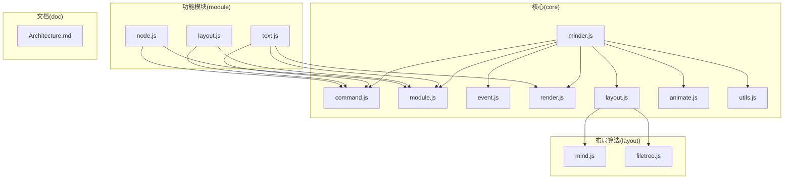
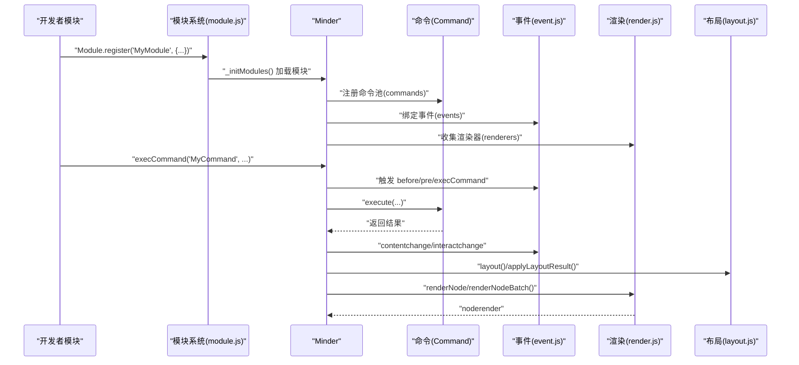
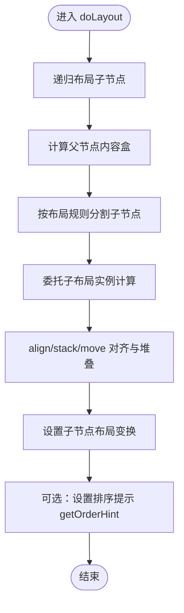
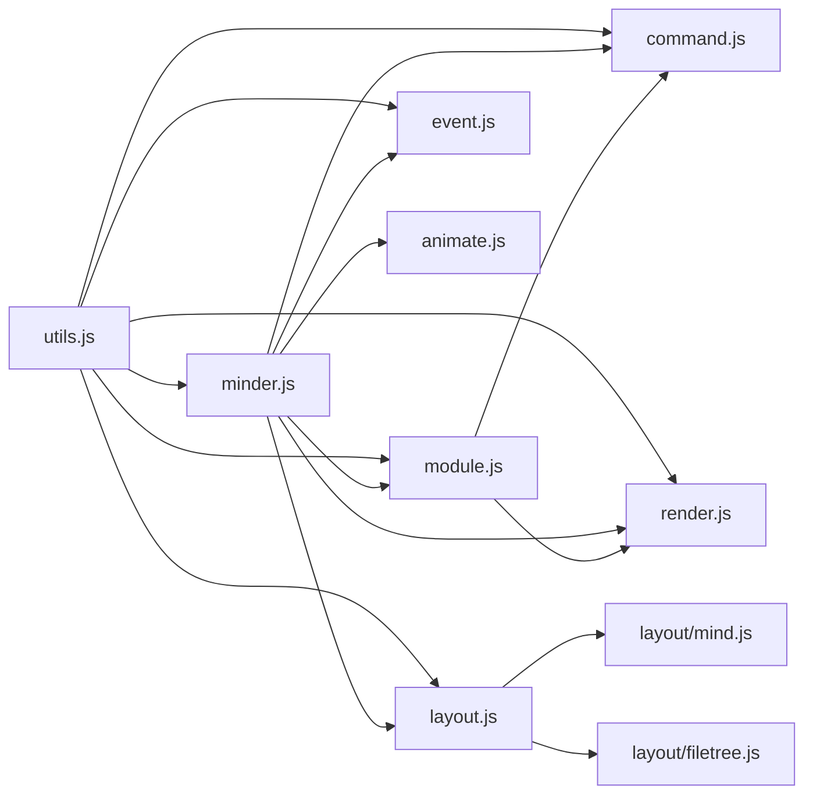

# 高级主题

<cite>
**本文引用的文件**
- [doc/Architecture.md](file://doc/Architecture.md)
- [src/core/module.js](file://src/core/module.js)
- [src/core/command.js](file://src/core/command.js)
- [src/core/layout.js](file://src/core/layout.js)
- [src/core/minder.js](file://src/core/minder.js)
- [src/core/event.js](file://src/core/event.js)
- [src/core/render.js](file://src/core/render.js)
- [src/core/animate.js](file://src/core/animate.js)
- [src/core/utils.js](file://src/core/utils.js)
- [src/module/text.js](file://src/module/text.js)
- [src/module/layout.js](file://src/module/layout.js)
- [src/module/node.js](file://src/module/node.js)
- [src/layout/mind.js](file://src/layout/mind.js)
- [src/layout/filetree.js](file://src/layout/filetree.js)
</cite>

## 目录
1. [引言](#引言)
2. [项目结构](#项目结构)
3. [核心组件](#核心组件)
4. [架构总览](#架构总览)
5. [详细组件分析](#详细组件分析)
6. [依赖分析](#依赖分析)
7. [性能考虑](#性能考虑)
8. [故障排查指南](#故障排查指南)
9. [结论](#结论)
10. [附录](#附录)

## 引言
本篇高级主题面向有经验的开发者，聚焦于如何在 KityMinder 核心之上进行深度扩展与优化。内容涵盖：
- 自定义模块开发：使用 Module.register 创建新功能模块，包括命令注册、事件监听与资源管理最佳实践
- 自定义命令开发：继承 Command 基类实现可撤销操作
- 自定义布局开发：扩展 Layout 基类与布局算法实现要点
- 性能优化策略：大规模数据渲染、动画控制与内存管理
- 扩展开发流程：从需求分析到测试部署，结合 Architecture.md 中的设计原则

## 项目结构
KityMinder 采用模块化架构，核心位于 src/core，功能模块位于 src/module，布局算法位于 src/layout，协议与模板、主题分别位于对应目录。doc/Architecture.md 提供了整体设计与模块职责说明。

图表来源
- [src/core/minder.js](file://src/core/minder.js#L1-L41)
- [src/core/command.js](file://src/core/command.js#L1-L169)
- [src/core/module.js](file://src/core/module.js#L1-L151)
- [src/core/event.js](file://src/core/event.js#L1-L270)
- [src/core/render.js](file://src/core/render.js#L1-L261)
- [src/core/layout.js](file://src/core/layout.js#L1-L524)
- [src/core/animate.js](file://src/core/animate.js#L1-L43)
- [src/core/utils.js](file://src/core/utils.js#L1-L66)
- [src/module/text.js](file://src/module/text.js#L1-L289)
- [src/module/layout.js](file://src/module/layout.js#L1-L92)
- [src/module/node.js](file://src/module/node.js#L1-L150)
- [src/layout/mind.js](file://src/layout/mind.js#L1-L62)
- [src/layout/filetree.js](file://src/layout/filetree.js#L1-L89)
- [doc/Architecture.md](file://doc/Architecture.md#L1-L120)

章节来源
- [doc/Architecture.md](file://doc/Architecture.md#L1-L120)

## 核心组件
- 模块系统：通过 Module.register 注册模块，Minder 在初始化阶段加载模块，注入命令、事件与渲染器，并在销毁/重置时回收资源
- 命令系统：Command 基类定义 execute/revert/queryState/queryValue/isContentChanged/isSelectionChanged 等约定，Minder.execCommand 统一调度并触发事件
- 布局系统：Layout 基类提供 doLayout、align、stack、move、getTreeBox/getBranchBox 等工具，Minder.layout/refresh/applyLayoutResult 实现两轮布局与动画
- 事件系统：MinderEvent 封装事件参数，Minder.on/off/fire/_fire/_interactChange 提供事件分发与交互事件稀释
- 渲染系统：Renderer 基类定义 create/update/draw/place 生命周期，Minder.renderNode/renderNodeBatch 批量渲染节点
- 动画与性能：animate.js 提供动画开关与时长配置；layout.js 在节点复杂度超过阈值时自动关闭动画

章节来源
- [src/core/module.js](file://src/core/module.js#L1-L151)
- [src/core/command.js](file://src/core/command.js#L1-L169)
- [src/core/layout.js](file://src/core/layout.js#L1-L524)
- [src/core/event.js](file://src/core/event.js#L1-L270)
- [src/core/render.js](file://src/core/render.js#L1-L261)
- [src/core/animate.js](file://src/core/animate.js#L1-L43)

## 架构总览
下图展示模块注册、命令执行、布局与渲染的关键交互路径，体现“模块—命令—事件—渲染”的闭环。

图表来源
- [src/core/module.js](file://src/core/module.js#L1-L151)
- [src/core/command.js](file://src/core/command.js#L1-L169)
- [src/core/event.js](file://src/core/event.js#L1-L270)
- [src/core/render.js](file://src/core/render.js#L1-L261)
- [src/core/layout.js](file://src/core/layout.js#L1-L524)

## 详细组件分析

### 自定义模块开发指南
- 模块注册与生命周期
  - 使用 Module.register 注册模块，返回对象包含 defaultOptions、init、commands、events、renderers、destroy、reset 等钩子
  - Minder 初始化时调用 _initModules，按模块清单加载，注册命令、绑定事件、收集渲染器
  - 销毁/重置时依次调用各模块的 destroy/reset，确保事件与资源回收
- 命令注册
  - 在模块的 commands 字段中注册命令类，Minder 将命令实例化并统一放入命令池
  - 命令名称统一小写，便于 execCommand 通过名称查找
- 事件监听
  - events 字段中可监听交互事件与自定义事件，this 指向 Minder 实例
  - 事件回调中可通过 minder.getSelectedNodes()、minder.getRoot() 等 API 获取上下文
- 资源管理
  - destroy/reset 中释放事件监听、DOM 或临时对象
  - 渲染器在渲染时动态创建/隐藏，避免长期持有大对象
- 最佳实践
  - 将默认配置放入 defaultOptions，避免硬编码
  - 将命令与事件分离，命令负责业务逻辑，事件负责 UI 交互
  - 使用 MinderEvent 的 getPosition/getTargetNode 等能力，提升事件处理一致性

章节来源
- [src/core/module.js](file://src/core/module.js#L1-L151)
- [src/core/event.js](file://src/core/event.js#L1-L270)
- [src/core/render.js](file://src/core/render.js#L1-L261)

### 自定义命令开发：可撤销操作
- 命令基类约定
  - 必须实现 execute(minder, ...args)，可选实现 revert(minder)
  - queryState/queryValue 用于查询状态与返回值
  - setContentChanged/setSelectionChanged 控制 contentchange/selectionchange 事件触发
- 执行流程
  - Minder.execCommand 触发 before/pre/execCommand 事件
  - 若命令返回内容变化，触发 contentchange；最后触发 interactchange
  - 命令内部应尽量保持幂等与可回滚
- 示例参考
  - 文本编辑命令：在 minder.getSelectedNode() 上设置文本，render 并 layout
  - 节点增删改命令：创建/删除节点、更新选区、触发布局
- 最佳实践
  - 在命令中最小化副作用，必要时通过 setContentChanged 显式标注
  - 对批量操作使用一次性布局，避免多次 layout 引起抖动
  - 对只读模式提供 enableReadOnly 支持

章节来源
- [src/core/command.js](file://src/core/command.js#L1-L169)
- [src/module/text.js](file://src/module/text.js#L1-L289)
- [src/module/node.js](file://src/module/node.js#L1-L150)

### 自定义布局开发：Layout 基类与算法要点
- 布局基类能力
  - doLayout(parent, children, round)：实现布局算法，设置子节点的布局变换
  - align(stack/move)、getTreeBox/getBranchBox：提供对齐、堆叠与区域计算工具
  - getOrderHint：返回节点排序提示区域与路径，辅助拖拽/插入
- 节点布局 API
  - MinderNode.getLayoutInstance/setLayout/layout/getLayoutOffset/setLayoutOffset/resetLayoutOffset
  - Minder.layout/refresh/applyLayoutResult：两轮布局与动画应用
- 算法实现要点
  - 先递归布局子节点，再根据父节点内容盒与子树盒计算变换
  - 使用 setLayoutTransform/translate/merge 等矩阵操作定位
  - 对于复杂布局，使用 getTreeBox 合并子树范围，避免重叠与越界
- 示例布局
  - 思维导图布局：将子节点分为左右两组，分别委托左右布局实例计算
  - 文件树布局：支持向上/向下两种方向，使用 align/stack/move 对齐与堆叠
- 最佳实践
  - 在 doLayout 中仅设置变换，不直接更新 DOM，交由 applyLayoutResult 执行动画
  - 对超大规模树（节点数>200）自动关闭动画，保证交互流畅
  - 使用 setLayoutOffset 支持用户微调，同时保留布局继承语义

图表来源
- [src/core/layout.js](file://src/core/layout.js#L1-L524)
- [src/layout/mind.js](file://src/layout/mind.js#L1-L62)
- [src/layout/filetree.js](file://src/layout/filetree.js#L1-L89)

章节来源
- [src/core/layout.js](file://src/core/layout.js#L1-L524)
- [src/layout/mind.js](file://src/layout/mind.js#L1-L62)
- [src/layout/filetree.js](file://src/layout/filetree.js#L1-L89)

### 事件系统与交互优化
- 事件分类与触发时机
  - 交互事件：click/dblclick/mousedown/mousemove/mouseup/keydown/keyup/touch*
  - Command 事件：beforecommand、precommand、aftercommand
  - 状态事件：selectionchange/contentchange/interactchange
- 事件传播与稀释
  - _firePharse 将原生事件封装为 MinderEvent，支持 stopPropagation/stopPropagationImmediately
  - _interactChange 对频繁交互事件进行稀释，降低重绘压力
- 事件监听与解绑
  - on/off 支持空格分隔的多事件名，off 支持移除特定回调
  - destroy/reset 时重置事件绑定，避免泄漏

章节来源
- [src/core/event.js](file://src/core/event.js#L1-L270)

### 渲染系统与批量更新
- 渲染器生命周期
  - create：首次创建渲染图形
  - update：根据节点数据更新图形并返回内容盒
  - draw/place：绘制与定位
- 批量渲染
  - renderNodeBatch：按渲染器顺序逐层处理，延迟盒计算，减少重复测量
  - shouldRender/shouldDraw：控制是否渲染与绘制，避免无效更新
- 最佳实践
  - 在 update 中复用图形对象，仅更新必要属性
  - 对多行文本等场景，按需增删子元素，避免频繁重建

章节来源
- [src/core/render.js](file://src/core/render.js#L1-L261)

## 依赖分析
- 模块依赖
  - minder.js 依赖 utils，作为初始化钩子承载者
  - module.js 依赖 utils、kity、minder，负责模块注册与生命周期
  - command.js 依赖 minder、node、event，提供命令执行与事件触发
  - layout.js 依赖 minder、node、event、command，提供布局注册与应用
  - event.js 依赖 minder、kity、utils，提供事件封装与分发
  - render.js 依赖 minder、node、kity，提供渲染器与批量渲染
  - animate.js 依赖 minder，提供动画开关与时长配置
  - utils.js 提供通用工具（extend/keys/uuid/clone/comparePlainObject）
- 模块间耦合
  - 模块通过 Module.register 与 Minder 解耦，命令通过 _commands 池集中管理
  - 布局通过 Layout.register 与 Minder.getLayoutInstance 解耦
  - 渲染器通过 _rendererClasses 收集，按节点渲染器类型分发

图表来源
- [src/core/utils.js](file://src/core/utils.js#L1-L66)
- [src/core/minder.js](file://src/core/minder.js#L1-L41)
- [src/core/module.js](file://src/core/module.js#L1-L151)
- [src/core/command.js](file://src/core/command.js#L1-L169)
- [src/core/layout.js](file://src/core/layout.js#L1-L524)
- [src/core/event.js](file://src/core/event.js#L1-L270)
- [src/core/render.js](file://src/core/render.js#L1-L261)
- [src/core/animate.js](file://src/core/animate.js#L1-L43)
- [src/layout/mind.js](file://src/layout/mind.js#L1-L62)
- [src/layout/filetree.js](file://src/layout/filetree.js#L1-L89)

章节来源
- [src/core/utils.js](file://src/core/utils.js#L1-L66)
- [src/core/minder.js](file://src/core/minder.js#L1-L41)
- [src/core/module.js](file://src/core/module.js#L1-L151)
- [src/core/command.js](file://src/core/command.js#L1-L169)
- [src/core/layout.js](file://src/core/layout.js#L1-L524)
- [src/core/event.js](file://src/core/event.js#L1-L270)
- [src/core/render.js](file://src/core/render.js#L1-L261)
- [src/core/animate.js](file://src/core/animate.js#L1-L43)
- [src/layout/mind.js](file://src/layout/mind.js#L1-L62)
- [src/layout/filetree.js](file://src/layout/filetree.js#L1-L89)

## 性能考虑
- 大规模数据渲染
  - 节点复杂度超过 200 时，自动关闭布局动画，避免卡顿
  - 批量渲染 renderNodeBatch 通过延迟盒计算减少重复测量
- 动画控制
  - 通过 animate.js 的 enableAnimation/disableAnimation 切换全局动画
  - 布局动画时长可配置，交互事件后进行稀释，避免频繁重绘
- 内存管理
  - 模块销毁/重置时清空选择、移除节点树，避免残留引用
  - 渲染器按需创建/隐藏，避免长期持有大对象
- 事件与布局联动
  - 命令执行后触发 contentchange/interactchange，布局仅在必要时刷新
  - 布局应用阶段对动画 timeline 进行停止与回收，防止泄漏

章节来源
- [src/core/layout.js](file://src/core/layout.js#L458-L520)
- [src/core/animate.js](file://src/core/animate.js#L1-L43)
- [src/core/module.js](file://src/core/module.js#L120-L151)
- [src/core/render.js](file://src/core/render.js#L85-L219)
- [src/core/event.js](file://src/core/event.js#L184-L231)

## 故障排查指南
- 命令未生效
  - 检查命令是否正确注册到模块的 commands 字段，名称是否小写一致
  - 确认 queryState 返回非负值，否则 execCommand 会短路
- 事件未触发
  - 确认事件监听是否在模块 init 中绑定，或在 Minder 实例上直接 on
  - 检查事件类型是否正确（如 click/dblclick/keydown 等）
- 布局异常
  - 检查 doLayout 是否仅设置变换，未直接操作 DOM
  - 确认 getTreeBox/align/stack/move 使用正确，避免越界
- 渲染闪烁
  - 使用 renderNodeBatch 批量渲染，避免逐节点频繁更新
  - 对多行文本等场景，避免频繁增删子元素
- 动画卡顿
  - 节点数超过阈值时自动关闭动画，可手动禁用动画以对比性能
  - 合理设置布局动画时长，避免过长动画导致交互延迟

章节来源
- [src/core/command.js](file://src/core/command.js#L118-L166)
- [src/core/event.js](file://src/core/event.js#L133-L231)
- [src/core/layout.js](file://src/core/layout.js#L391-L520)
- [src/core/render.js](file://src/core/render.js#L85-L219)
- [src/core/animate.js](file://src/core/animate.js#L1-L43)

## 结论
通过模块化架构与清晰的命令、事件、布局、渲染管线，KityMinder 为高级扩展提供了坚实基础。遵循以下原则可高效构建高质量扩展：
- 模块化：以模块为单位封装功能，命令与事件分离
- 可撤销：命令实现可逆逻辑，合理标注内容/选区变更
- 布局抽象：在 Layout 基类上实现算法，避免直接操作 DOM
- 性能优先：批量渲染、动画阈值、事件稀释与资源回收
- 设计原则：参考 Architecture.md 的模块职责与事件模型，确保扩展与核心一致

## 附录
- 扩展开发流程建议
  - 需求分析：明确功能边界与交互行为
  - 模块设计：确定命令、事件、渲染器与布局需求
  - 实现与测试：编写命令与模块，覆盖关键事件与边界条件
  - 性能评估：在大数据集上验证布局与渲染表现
  - 部署与维护：提供配置项与文档，持续优化与回归测试

章节来源
- [doc/Architecture.md](file://doc/Architecture.md#L140-L210)